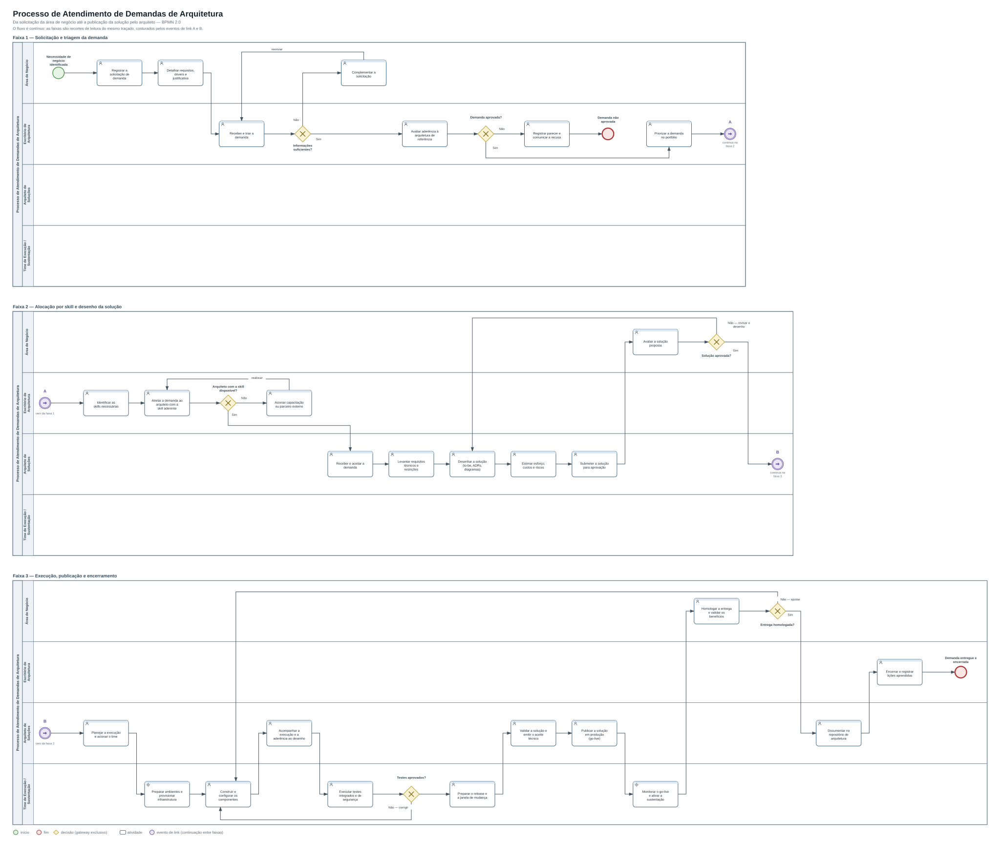

# Processo de Demanda de Arquitetura (BPMN)

Antes de desenhar o produto, era preciso desenhar o **trabalho que o produto automatiza**. O ArqFlow não inventa um processo novo: ele digitaliza um fluxo que hoje acontece em e-mail, planilha e apresentação, sem rastreabilidade. Este documento é o registro desse fluxo em notação **BPMN 2.0**, do momento em que a área de negócio abre a solicitação até a publicação da solução pelo arquiteto.

Modelar isso ainda no discovery tem uma consequência prática: cada requisito funcional passa a ter uma atividade de origem. Quando um requisito não corresponde a nenhuma atividade do processo — ou quando uma atividade não tem requisito que a cubra — a lacuna aparece aqui, e não depois da implementação.

## O processo

**Leitura:**

- O fluxo é **um só, contínuo**. As três faixas são quebras de leitura, não processos separados: os **eventos de link A e B** (círculos roxos) fecham uma faixa e reabrem a mesma sequência na faixa seguinte. É a construção BPMN padrão para continuar um fluxo sem uma seta atravessando o diagrama inteiro.
- Quatro papéis, quatro raias: a **Área de Negócio** abre e homologa, o **Escritório de Arquitetura** filtra e prioriza, o **Arquiteto de Soluções** desenha e publica, o **Time de Execução** constrói e sustenta. Cada faixa mostra apenas as raias que atuam naquela etapa.
- A demanda **pode não virar solução**. O único caminho de saída antecipada está na Faixa 1 (`Demanda não aprovada`), e é deliberado: filtrar cedo é mais barato que descobrir na aprovação do desenho que a demanda não era aderente à arquitetura de referência.
- Os **cinco retornos** (setas rotuladas para trás) são onde o processo real gasta tempo: informação incompleta, arquiteto indisponível, desenho reprovado, teste reprovado e homologação reprovada. Um sistema que só modela o caminho feliz não serve para operar este processo.

## As três faixas

| Faixa | O que acontece | Papel dominante |
|---|---|---|
| 1. Solicitação e triagem | Registro da demanda, detalhamento, triagem, avaliação de aderência à arquitetura de referência e priorização no portfólio | Área de Negócio → Escritório de Arquitetura |
| 2. Alocação por skill e desenho | Identificação das skills exigidas, alocação do arquiteto aderente, levantamento técnico, desenho da solução, estimativa e aprovação | Escritório de Arquitetura → Arquiteto de Soluções |
| 3. Execução, publicação e encerramento | Planejamento, provisionamento, construção, testes, publicação em produção, homologação, documentação e encerramento | Arquiteto de Soluções → Time de Execução |

## Pontos de decisão

| Gateway | Pergunta | Se "não" |
|---|---|---|
| 1 | Informações suficientes? | Volta para a área de negócio complementar a solicitação |
| 2 | Demanda aprovada? | Registra o parecer e encerra em `Demanda não aprovada` |
| 3 | Arquiteto com a skill disponível? | Aciona capacitação ou parceiro externo e realoca |
| 4 | Solução aprovada? | Volta para o arquiteto revisar o desenho |
| 5 | Testes aprovados? | Volta para a construção corrigir |
| 6 | Entrega homologada? | Volta para a construção ajustar |

O gateway 3 é o que caracteriza este processo: a demanda não é atribuída a quem está livre, e sim a quem tem a **skill aderente** ao que a demanda exige. Quando não há ninguém com a skill, isso não é uma exceção silenciosa — é um caminho explícito, com custo (capacitação ou parceiro) e impacto em prazo.

## Onde o ArqFlow entra

| Atividade do processo | Requisito que a cobre |
|---|---|
| Registrar a solicitação de demanda | [RF-01 — Registro de demanda](../02-requisitos/requisitos-funcionais.md) |
| Desenhar a solução (to-be, ADRs, diagramas) | [RF-02 — Criação de cenários alternativos](../02-requisitos/requisitos-funcionais.md) e [RF-05 — Anexação de desenho](../02-requisitos/requisitos-funcionais.md) |
| Estimar esforço, custos e riscos | [RF-03 — Cotação FinOps](../02-requisitos/requisitos-funcionais.md) e [RF-04 — Comparação entre nuvens](../02-requisitos/requisitos-funcionais.md) |
| Submeter a solução / Avaliar a solução proposta | [RF-06 — Aprovação de cenário](../02-requisitos/requisitos-funcionais.md) |
| Documentar no repositório de arquitetura | [RF-06](../02-requisitos/requisitos-funcionais.md) — a aprovação dispara a sincronização com a BiZZdesign ([ADR-0003](../03-decisoes-arquiteturais/0003-sincronizacao-assincrona-com-bizzdesign.md)) |
| Priorizar no portfólio / Encerrar a demanda | [RF-08 — Dashboard de andamento](../02-requisitos/requisitos-funcionais.md) |
| Acesso do solicitante e do arquiteto (todas as raias) | [RF-07 — SSO corporativo](../02-requisitos/requisitos-funcionais.md) ([ADR-0002](../03-decisoes-arquiteturais/0002-federacao-de-identidade-via-gateway-oidc.md)) |

Três observações que só apareceram depois de modelar o fluxo:

1. **Alocação por skill não tem requisito.** As atividades `Identificar as skills necessárias` e `Atrelar a demanda ao arquiteto com a skill aderente` não correspondem a nenhum RF-01…RF-08. Ou o ArqFlow assume que a alocação continua fora da ferramenta — e aí a rastreabilidade do processo tem um buraco no meio —, ou falta um requisito de catálogo de skills e alocação. Fica registrado aqui como decisão de escopo a tomar, não como requisito implícito.
2. **A aprovação não espera a integração.** No diagrama, `Documentar no repositório de arquitetura` é uma atividade do arquiteto que acontece **depois** da publicação, e a sincronização com a BiZZdesign é assíncrona (ADR-0003). O processo e a arquitetura concordam: nada no caminho crítico da demanda depende de um sistema de terceiro responder.
3. **A estimativa acontece antes da aprovação.** É isso que sustenta o requisito de cotação rápida (RNF < 1s, [ADR-0004](../03-decisoes-arquiteturais/0004-motor-de-custeio-com-cache-de-precos.md)): a estimativa é insumo da decisão, não relatório posterior. Se ela demorasse, o arquiteto submeteria o desenho sem custo — e o gateway 4 decidiria no escuro.

## Arquivo editável

O modelo está em [`Processo_Demanda_Arquitetura.bpmn`](Processo_Demanda_Arquitetura.bpmn) — XML BPMN 2.0 padrão, 41 elementos e 43 fluxos de sequência, com diagrama (BPMNDI) embutido. Abre para edição no [Camunda Modeler](https://camunda.com/download/modeler/), no Bizagi Modeler ou em [demo.bpmn.io](https://demo.bpmn.io), sem conversão.

**Nota técnica:** a imagem publicada acima é **gerada a partir do próprio `.bpmn`**, e não desenhada à parte. Um script lê o diagrama embutido no arquivo (BPMNDI), corta o traçado nos dois eventos de link e empilha os três trechos. Cada faixa é uma translação rígida de um pedaço do desenho: formas, tamanhos, roteamento das setas e rótulos ficam exatamente como estão no arquivo — nada é redesenhado nem re-roteado. Os cortes caem entre o evento de link que fecha uma faixa e o que abre a seguinte, então nenhuma forma e nenhuma seta é atravessada por eles.

O motivo do recorte é de leitura: em faixa única, o processo ocupa quase 8.000 px de largura e fica ilegível embutido em uma página; recortado, cabe em 3.112 × 2.622. É a mesma escolha pragmática já feita no [diagrama de implantação](../04-diagramas/README.md) — a notação é a mesma, o que muda é o posicionamento, com coordenadas explícitas em vez de layout automático.
