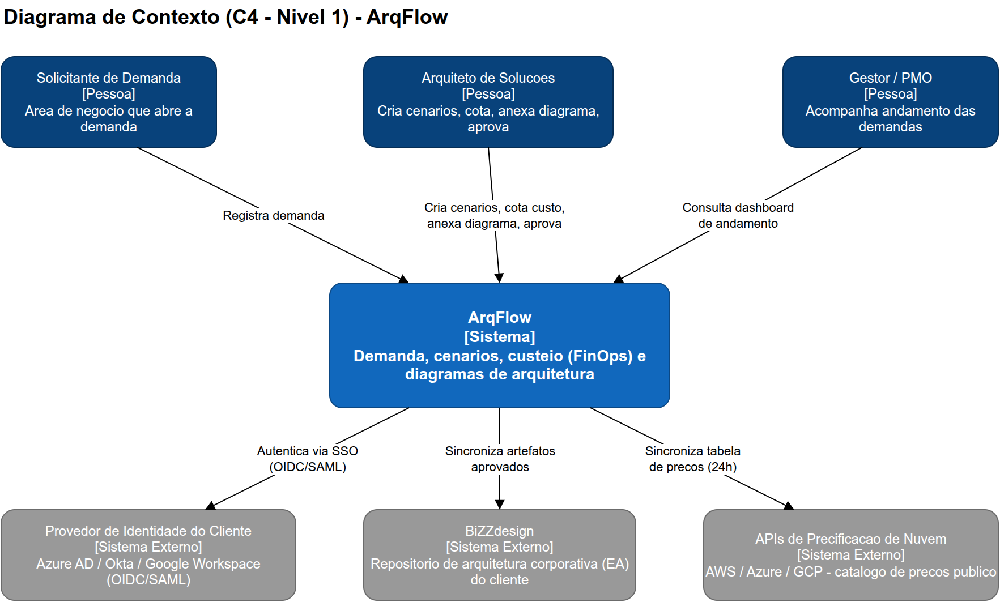
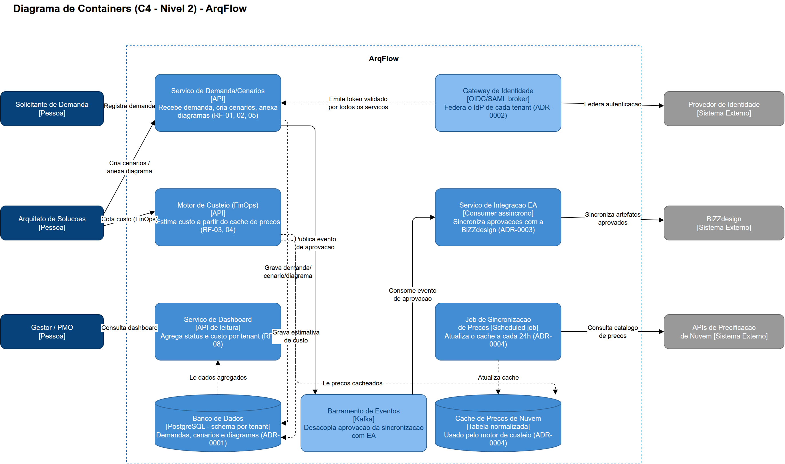

# Diagramas

Diagramas em modelo **C4** (Contexto → Containers), feitos em [draw.io](https://app.diagrams.net/) (arquivos `.drawio`, editáveis, com export em PNG para visualização direta aqui no GitHub).

1. [`contexto.drawio`](contexto.drawio) /  — ArqFlow e seus atores/sistemas externos: solicitante de demanda, arquiteto de soluções, gestor/PMO, provedor de identidade do cliente, BiZZdesign e as APIs de precificação de nuvem
2. [`containers.drawio`](containers.drawio) /  — os serviços internos definidos nos ADRs ([0001](../03-decisoes-arquiteturais/0001-multi-tenancy-schema-por-tenant.md)–[0004](../03-decisoes-arquiteturais/0004-motor-de-custeio-com-cache-de-precos.md)) e como se comunicam

## Diagrama de Contexto

**Leitura:** o ArqFlow nunca fala diretamente com o provedor de identidade do cliente por conta própria — a autenticação é sempre federada (ver [ADR-0002](../03-decisoes-arquiteturais/0002-federacao-de-identidade-via-gateway-oidc.md)). A sincronização com a BiZZdesign e com as APIs de precificação de nuvem acontece de forma assíncrona/periódica, não em tempo real (ver [ADR-0003](../03-decisoes-arquiteturais/0003-sincronizacao-assincrona-com-bizzdesign.md) e [ADR-0004](../03-decisoes-arquiteturais/0004-motor-de-custeio-com-cache-de-precos.md)).

## Diagrama de Containers

**Leitura:**
- O **Gateway de Identidade** fica isolado em sua própria coluna — nenhum serviço interno fala diretamente com o IdP do cliente, todos confiam no token emitido pelo gateway (ADR-0002).
- O **Banco de Dados** é organizado por schema-por-tenant (ADR-0001) e é a fonte de dados de demanda/cenário/diagrama; o **Serviço de Dashboard** lê de lá, nunca escreve.
- A aprovação de um cenário publica um evento no **Barramento de Eventos**, consumido de forma assíncrona pelo **Serviço de Integração EA** — a aprovação em si nunca espera a BiZZdesign responder (ADR-0003).
- O **Motor de Custeio** nunca chama as APIs de nuvem diretamente; ele lê do **Cache de Preços**, que é atualizado por um job periódico separado (ADR-0004) — por isso a cotação de um cenário é local e rápida (RNF < 1s).
