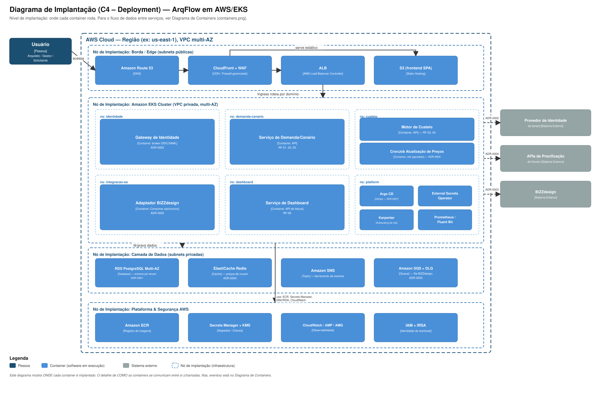

# Arquitetura AWS de Referência

Esta arquitetura implanta os serviços definidos em [`04-diagramas/containers.png`](../04-diagramas/containers.png) sobre AWS, com Amazon EKS como orquestrador ([ADR-0005](../03-decisoes-arquiteturais/0005-eks-como-orquestrador-de-containers.md)). O desenho segue três preocupações centrais, todas herdadas de decisões já tomadas no portfólio: isolamento de tenant na camada de dados e identidade (não em compute), resiliência a sistemas de terceiros indisponíveis (BiZZdesign, IdPs, APIs de precificação de nuvem), e nenhuma credencial de escrita em produção morando fora do cluster.

## Diagrama

*(SVG — nível C4 de Implantação/Deployment, mesma notação usada em [`04-diagramas/`](../04-diagramas/README.md); mostra onde cada container roda, não como eles se comunicam entre si — isso está no [Diagrama de Containers](../04-diagramas/containers.png).)*

**Leitura do diagrama:** o frontend (SPA) é servido estático via CloudFront + S3, protegido por WAF (regras gerenciadas OWASP). Toda chamada de API passa pelo ALB e entra no cluster via um namespace de domínio — nunca existe um caminho que fale diretamente com o banco ou com um sistema de terceiros sem passar por um serviço interno. O Gateway de Identidade é o único ponto que federa com o IdP do cliente (ADR-0002); o Adaptador BiZZdesign é o único que fala com a BiZZdesign, sempre a partir de uma fila (ADR-0003), nunca de forma síncrona.

## Rede

VPC multi-AZ (mínimo 3 AZs) com subnets públicas (ALB, NAT Gateway) e subnets privadas para o EKS e para a camada de dados. Não existe subnet pública com node de EKS ou com RDS. `NetworkPolicy` (via Amazon VPC CNI) aplica default-deny entre os namespaces de domínio descritos no [ADR-0006](../03-decisoes-arquiteturais/0006-isolamento-multi-tenant-por-dominio-nao-por-tenant.md), com exceções explícitas por fluxo conhecido.

## Compute — EKS

- **Node groups gerenciados** para cargas estáveis (Gateway de Identidade, Demanda/Cenário, Dashboard) e **Karpenter** para cargas variáveis/em rajada (worker de integração EA, jobs de custeio), com consolidação automática de nós para controlar custo.
- Namespaces por domínio ([ADR-0006](../03-decisoes-arquiteturais/0006-isolamento-multi-tenant-por-dominio-nao-por-tenant.md)), cada um com `ResourceQuota`/`LimitRange` próprios.
- Detalhes de RBAC, segurança de pod, autoscaling e entrega progressiva estão em [`kubernetes-boas-praticas.md`](kubernetes-boas-praticas.md).

## Dados

- **RDS PostgreSQL Multi-AZ**, schema por tenant ([ADR-0001](../03-decisoes-arquiteturais/0001-multi-tenancy-schema-por-tenant.md)). Read replica para consultas administrativas cross-tenant, que o próprio ADR-0001 já identifica como mais custosas nesse modelo.
- **ElastiCache Redis** para o cache de preços do motor de custeio ([ADR-0004](../03-decisoes-arquiteturais/0004-motor-de-custeio-com-cache-de-precos.md)) — leitura local em memória é o que sustenta o RNF de cotação < 1s sem depender de chamada síncrona às APIs de nuvem.
- **Amazon SNS + SQS (com DLQ)** para o barramento de eventos e a fila de sincronização com a BiZZdesign ([ADR-0003](../03-decisoes-arquiteturais/0003-sincronizacao-assincrona-com-bizzdesign.md)) — a fila absorve a variação de disponibilidade da BiZZdesign; mensagens que esgotam as tentativas de retry vão para a DLQ, que dispara um alarme no CloudWatch (é isso que garante que "falha de sincronização nunca é silenciosa", exigido pelo RNF correspondente).

## Segurança e identidade

- **IRSA (IAM Roles for Service Accounts):** cada `ServiceAccount` do Kubernetes assume uma IAM Role própria e mínima — só o adaptador BiZZdesign pode consumir da fila e ler o segredo da API da BiZZdesign; só o job de custeio pode escrever no cache de preços. Nenhum pod usa uma credencial estática de longa duração.
- **Secrets Manager + KMS:** segredos (credenciais de banco, token de API da BiZZdesign, chaves do gateway de identidade) nunca são commitados em manifest ou Helm values; o External Secrets Operator os sincroniza para dentro do cluster como `Secret` nativo, sob demanda.
- **ECR** com scan de vulnerabilidade obrigatório e tags imutáveis — imagem sem scan aprovado não é elegível para deploy (reforçado por policy-as-code, ver [`esteira-cicd.md`](esteira-cicd.md)).

## Observabilidade

CloudWatch Container Insights e Fluent Bit para logs centralizados; Amazon Managed Prometheus (AMP) e Amazon Managed Grafana (AMG) para métricas; toda métrica e log carrega o identificador de tenant e o namespace de domínio como atributo — a forma de investigar um incidente específico de um cliente em um ambiente de compute compartilhado (consequência direta do [ADR-0006](../03-decisoes-arquiteturais/0006-isolamento-multi-tenant-por-dominio-nao-por-tenant.md)).

## Estimativa de custo (FinOps)

Estimativa de custo mensal desta arquitetura, com cenário otimizado e custo marginal por tenant adicional, em [`estimativa-finops.md`](estimativa-finops.md).

## Infraestrutura como código

Terraform, organizado em módulos por camada (rede, EKS, dados, mensageria, IAM), com state remoto em S3 e lock via DynamoDB. `checkov`/`tfsec` roda como gate na esteira antes de qualquer `apply` (ver [`esteira-cicd.md`](esteira-cicd.md#pipeline-de-infraestrutura)). Ambientes (dev/staging/prod) são workspaces/state files separados, não uma única infraestrutura compartilhada com `if` de ambiente espalhado pelo código.

## O que foi deliberadamente deixado de fora (por ora)

- **Service mesh completo (Istio/App Mesh):** avaliado e adiado. Com o número atual de serviços internos, `NetworkPolicy` + IRSA já cobrem as garantias de segurança necessárias; mTLS automático entre todos os serviços internos seria um ganho real, mas a complexidade operacional adicional não se justifica ainda. Revisitar se o número de serviços internos crescer substancialmente ou se um cliente exigir mTLS ponta a ponta como requisito contratual.
- **Multi-região ativa-ativa:** o RNF de disponibilidade (99,5%) não exige isso — um desenho multi-AZ dentro de uma única região já atende. Multi-região entraria em pauta apenas se o RNF de disponibilidade mudasse para um patamar de missão crítica, o que o discovery não indicou.
