# Esteira de CI/CD

Descreve como uma mudança sai de um commit e chega a produção, dividida em três esteiras independentes: **CI de aplicação**, **CD via GitOps** (Argo CD, [ADR-0007](../03-decisoes-arquiteturais/0007-gitops-com-argocd-para-entrega-continua.md)) e **pipeline de infraestrutura** (Terraform). Ferramenta de CI: GitHub Actions, por já ser o mesmo ecossistema onde o código está hospedado.

## Diagrama do fluxo

```mermaid
flowchart LR
    Dev["Dev abre PR"] --> Checks["Checks do PR:\nlint, testes, SAST,\nplano Terraform (se aplicável)"]
    Checks -->|aprovado + merge| CI["CI (GitHub Actions)"]

    subgraph CI["Pipeline de CI"]
        Build["Build da imagem"]
        Test["Testes automatizados"]
        Scan["Scan de vulnerabilidade\n(Trivy) + SAST (CodeQL)"]
        Push["Push para ECR\n(tag imutável = git sha)"]
        UpdateManifest["Atualiza repositório\nde manifests (PR automático)"]
        Build --> Test --> Scan --> Push --> UpdateManifest
    end

    UpdateManifest --> ArgoDev["Argo CD: sync automático em dev"]
    ArgoDev --> SmokeDev["Smoke tests em dev"]
    SmokeDev -->|ok| PRStaging["PR de promoção: dev -> staging"]
    PRStaging --> ArgoStaging["Argo CD: sync automático em staging"]
    ArgoStaging --> SmokeStaging["Smoke tests em staging"]
    SmokeStaging -->|aprovação manual| PRProd["PR de promoção: staging -> prod"]
    PRProd --> ArgoProd["Argo CD: sync em prod"]
    ArgoProd --> Canary["Argo Rollouts: canary\ncom análise automática"]
    Canary -->|métricas ok| Prod["100% em produção"]
    Canary -->|regressão| Rollback["Rollback automático"]
```

## Estratégia de branching

Trunk-based: branches de feature curtas, PR obrigatório com revisão de outra pessoa antes do merge em `main`. Nenhum merge direto sem PR, mesmo para mudanças pequenas — é o próprio PR que dispara os checks de qualidade e segurança.

## Pipeline de CI (por serviço)

1. **Lint e testes unitários** — falha aqui bloqueia o PR antes de qualquer build de imagem, para dar feedback rápido.
2. **Build da imagem** — multi-stage build, imagem final mínima (base *distroless* ou *slim*), sem ferramentas de build no artefato final.
3. **Scan de segurança** — Trivy para vulnerabilidades de imagem/dependências, CodeQL (SAST) para o código. Vulnerabilidade crítica sem exceção documentada bloqueia o pipeline.
4. **Push para ECR** com tag imutável (hash do commit, nunca `latest`) — rastreabilidade completa entre uma imagem em produção e o commit exato que a gerou.
5. **Atualização do repositório de manifests** — a esteira abre um PR automático atualizando a tag da imagem no Helm values/kustomize daquele serviço; não aplica nada diretamente no cluster (ADR-0007).

## Pipeline de CD (Argo CD)

- **Dev:** sync automático a cada merge no repositório de manifests — feedback rápido, sem aprovação manual.
- **Staging:** sync automático, mas condicionado à passagem de smoke tests em dev e à abertura de um PR de promoção explícito (visível e revisável, não implícito).
- **Produção:** promoção exige aprovação manual de uma pessoa responsável (tech lead/gestor), dentro de uma janela de deploy definida. O deploy em si usa Argo Rollouts para canary nos serviços mais críticos (Demanda/Cenário, Motor de Custeio, ver [`kubernetes-boas-praticas.md`](kubernetes-boas-praticas.md#entrega-progressiva)), com análise automática de métricas de erro/latência decidindo se o rollout avança ou sofre rollback — sem depender de alguém estar observando um dashboard no momento exato do deploy.

## Gates de qualidade e segurança

Kyverno (policy-as-code no próprio cluster) bloqueia, na admissão, qualquer manifest que viole a postura mínima de segurança — container como root, sem `resources` definidos, imagem sem tag imutável — como uma segunda linha de defesa, mesmo que algo escape dos checks da esteira.

## Pipeline de infraestrutura (Terraform)

Separado do pipeline de aplicação, com seu próprio ciclo: `terraform plan` roda em todo PR que toca módulos de infraestrutura, com `checkov`/`tfsec` validando políticas (ex: nenhum security group aberto para `0.0.0.0/0` em porta de banco, nenhum bucket S3 público). `terraform apply` em produção exige aprovação manual explícita, nunca automático — diferente do deploy de aplicação, mudança de infraestrutura tem blast radius maior e menos garantias de rollback automático.

## Rollback

- **Aplicação:** reverter o commit correspondente no repositório de manifests — o Argo CD reconcilia de volta ao estado anterior. Não existe "re-execução manual de pipeline" como único caminho de rollback.
- **Rollout em andamento:** abortado automaticamente pelo Argo Rollouts com base em métricas, sem esperar intervenção humana.
- **Infraestrutura:** reverter o commit do módulo Terraform e reaplicar — por isso o state remoto (S3 + lock DynamoDB) e a disciplina de nunca aplicar Terraform fora da esteira são não negociáveis.

## Segurança de credenciais na esteira

GitHub Actions se autentica na AWS via federação OIDC com uma IAM Role de permissão restrita (push em ECR, leitura/escrita no repositório de manifests) — nenhuma chave de acesso de longa duração é armazenada como secret do GitHub. Consistente com o [ADR-0007](../03-decisoes-arquiteturais/0007-gitops-com-argocd-para-entrega-continua.md): a esteira nunca tem, em nenhum momento, uma credencial de escrita direta no cluster de produção.
